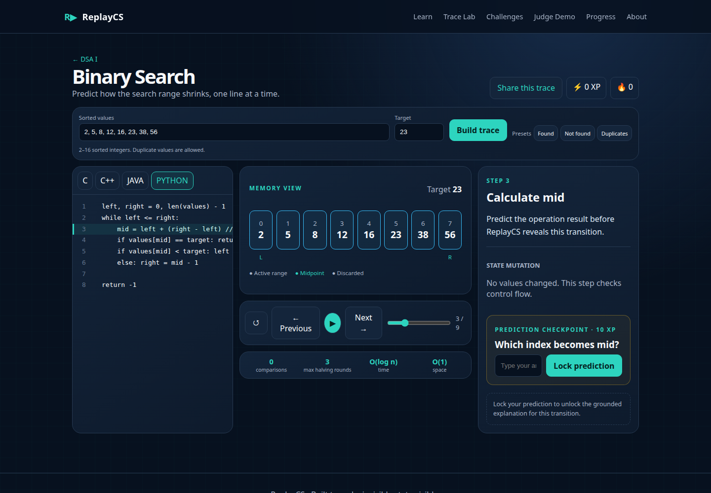
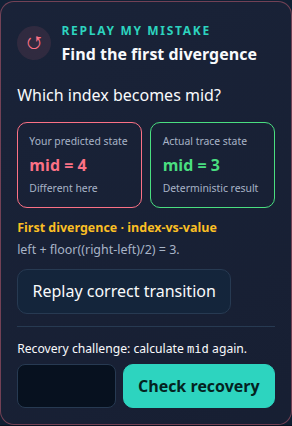
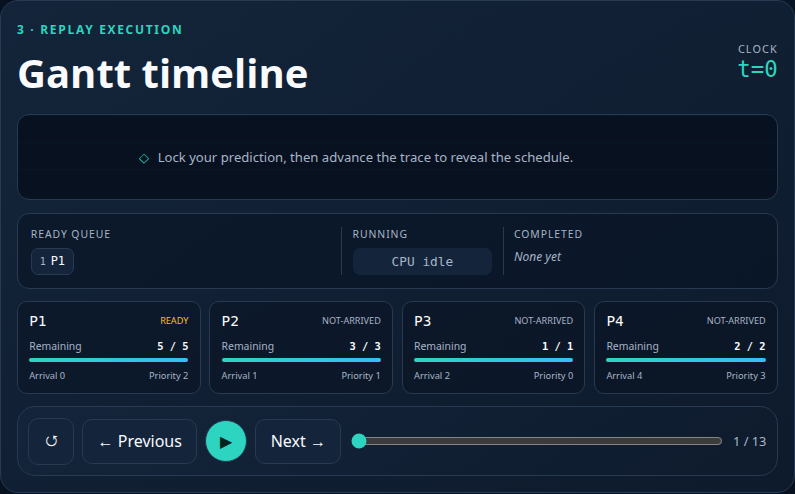
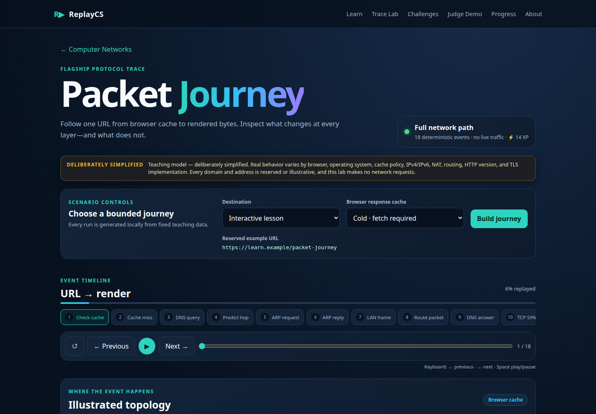
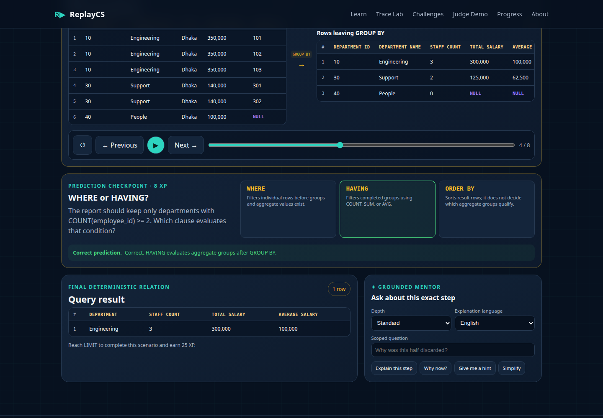
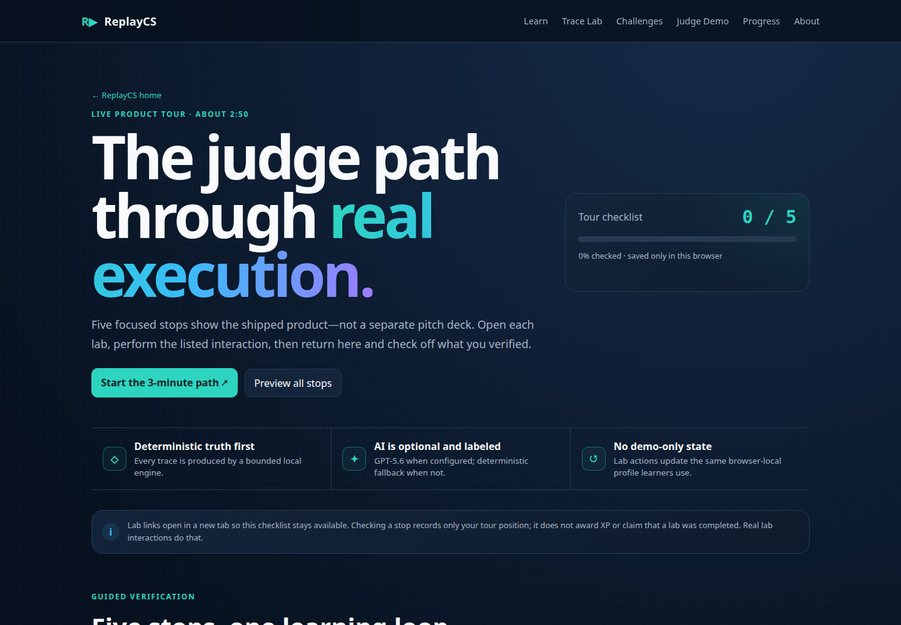

# R▶ ReplayCS

> **Pause computer science. Trace every state. Understand what actually happens.**

ReplayCS is a prediction-first execution laboratory for computer science. A learner commits to what
the computer will do next, reveals a deterministic state transition, replays mistakes, and can ask a
grounded GPT-5.6 mentor why the transition occurred.

[Open ReplayCS](https://replaycs.vercel.app) ·
[Start the Judge Demo](https://replaycs.vercel.app/judge-demo) ·
[View the repository](https://github.com/meteorboyF/ReplayCS) ·
[Check system health](https://replaycs.vercel.app/api/health)

No account or API key is required for the learning experience. Progress stays in the learner's
browser.

## The problem

Students often recognize an algorithm, query, or protocol after seeing the answer but struggle to
predict its next state. That gap is hidden by static notes and output-only visualizers. ReplayCS
makes the learner commit first, then turns execution into evidence they can inspect and reverse.

## What a learner does

1. Choose a curated scenario or bounded custom input.
2. Inspect the current source operation and state.
3. Lock a prediction before a meaningful reveal.
4. Step forward or backward through exact snapshots.
5. Compare the prediction with deterministic truth.
6. If wrong, inspect misconception feedback; in Binary Search and SQL, use **Replay My Mistake** to
   find the first divergence and complete a recovery check.
7. Optionally ask GPT-5.6 for an explanation grounded in that exact trace step.
8. Build browser-local XP, mastery, misconception evidence, and recommendations from real actions.

The [Judge Demo](https://replaycs.vercel.app/judge-demo) links a stable version of that loop across
the flagship labs in under three minutes. Its markers do not award progress; the linked lab actions
are the real product interactions.

## Functional learning experiences

| Subject           | Shipped experience           | What is deterministic                                                                         |
| ----------------- | ---------------------------- | --------------------------------------------------------------------------------------------- |
| DSA I             | Binary Search; Sorting Arena | Search bounds and midpoint; Bubble, Selection, and Insertion Sort operations                  |
| DSA II            | Graph Explorer               | BFS, iterative DFS, and recursive DFS frontier/visited transitions                            |
| DBMS              | SQL Query Pipeline           | `FROM → JOIN → WHERE → GROUP BY → HAVING → SELECT → ORDER BY → LIMIT` intermediate relations  |
| Operating Systems | CPU Scheduling Arena         | FCFS, SJF, SRTF, Priority, and Round Robin Gantt/metric calculations                          |
| Computer Networks | Packet Journey               | Cold/warm browser paths through cache, DNS, ARP, TCP, TLS, HTTP, decapsulation, and rendering |

The Challenge Arena adds five deterministic two-checkpoint bosses: Binary Bounds, BFS Frontier, SQL
Pipeline, Round Robin, and Packet Route. Each supports check, retry, reveal, and replay; completion
awards 30 XP once, with Boss Tracer/Arena Champion badges. Revealing an answer makes that run
practice-only, so it cannot clear the boss or award XP. Planned lesson cards remain labeled as
planned; ReplayCS does not treat a subject dashboard as a finished lab.

Curated C, C++, Java, and Python source mappings apply to Binary Search and Graph Explorer.
Switching languages preserves the semantic trace step and visualization state. SQL Query Pipeline,
CPU Scheduling, and Packet Journey do not claim four-language simulation.

## Manual Trace and Replay My Mistake

The deterministic engine emits serializable before/after snapshots. The player selects a snapshot
instead of trying to reverse an animation, so backward navigation restores the exact earlier state.
Prediction checkpoints are evaluated locally; GPT never chooses the correct answer.

Every flagship lab records deterministic prediction evidence, persistent completion/mastery, and
misconception tags. Binary Search and the SQL pipeline go further with the complete recovery loop:
an incorrect prediction preserves the learner's answer, places predicted and actual state side by
side, labels the first divergence, replays the correct transition, and offers an idempotently
rewarded recovery check.

Lesson mastery is transparent rather than inferred by a model: 50 points come from completing the
trace, 30 from a correct prediction or recovery, and the final 20 from succeeding first try without
a hint or fully recovering every recorded mistake. The progress page also derives first-attempt
accuracy and average attempts from unique checkpoint evidence, and persists hint requests,
code-language interactions, recent XP activity, and boss clears in the same local profile.

## Grounded GPT-5.6 mentor

The shared mentor is connected inside every shipped flagship lab. The browser sends a bounded
context containing the lesson, active operation, before/after state, learner prediction,
misconception evidence, language where relevant, and explanation level to a SvelteKit server route.
Server-only code calls the OpenAI Responses API with a structured Zod schema; the canonical trace
never comes from the model.

The mentor supports step explanations, “why,” hints, simplification, mistake explanation, four depth
levels, and English or Bangla teaching text. Without `OPENAI_API_KEY`, when an upstream call fails,
or when model output misses the structured schema, the same UI shows a deterministic grounded
explanation. The public deployment currently operates in this no-key fallback mode; `/api/health`
reports that state without exposing configuration values. Hint requests are recorded as learning
evidence; deterministic hints reason from the current operation without revealing the resulting
state.

See [OpenAI integration](docs/openai-integration.md) for the trust boundary and production behavior.

## Screenshots

| Prediction-first trace                                              | Mistake recovery                                                                       |
| ------------------------------------------------------------------- | -------------------------------------------------------------------------------------- |
|  |  |

| CPU scheduling                                                       | Packet journey                                                          |
| -------------------------------------------------------------------- | ----------------------------------------------------------------------- |
|  |  |

| SQL reasoning                                                  | Judge path                                                |
| -------------------------------------------------------------- | --------------------------------------------------------- |
|  |  |

The checked-in images are generated from the real application. Recreate the full landing, lesson,
progress, and Judge Demo set with the [capture script](scripts/capture-screenshots.mjs):

```bash
npx playwright install chromium # once
npm run screenshots
```

To capture the public deployment instead of a local production build:

```bash
REPLAYCS_BASE_URL=https://replaycs.vercel.app npm run screenshots
```

The workflow is strict: it captures 11 real screens across 10 routes, including Graph Explorer,
Challenge Arena, and Judge Demo, and exits unsuccessfully if any required screen cannot be reached.
When running locally, it also refuses to reuse an unknown process already listening on the preview
port.

## Architecture

```text
curated scenario / bounded input
               │
               ▼
      deterministic engine ───────────────┐
               │                          │
               ▼                          ▼
    serializable TraceStep snapshots   local scoring
       │          │          │            │
       ▼          ▼          ▼            ▼
 source map   visual state   controls   progress/mastery
       └──────────┬───────────┘
                  ▼
        optional server-only mentor
       (GPT-5.6 or deterministic fallback)
```

Trace generation, rendering, learner progress, and AI explanation are separate systems. SvelteKit
server routes keep OpenAI credentials out of browser bundles; the Vercel adapter preserves those
routes in production. Read the [architecture](docs/architecture.md) and
[product specification](docs/product-spec.md) for details.

## Local setup

Requires Node.js 22 or 24 and npm. CI and Vercel builds use Node.js 24; deployed functions explicitly
target the Node.js 22 runtime.

```bash
git clone https://github.com/meteorboyF/ReplayCS.git
cd ReplayCS
npm ci
cp .env.example .env
npm run dev
```

AI is optional. To enable it, edit the uncommitted `.env` file locally:

```dotenv
OPENAI_API_KEY=
OPENAI_MODEL=gpt-5.6
```

Never place the key in a public-prefixed variable, browser code, a commit, or chat. The app remains
functional when both values are empty.

## Verification

```bash
npm run check       # Svelte and TypeScript contracts
npm run lint        # Prettier check
npm run test        # deterministic engine and progress tests
npm run build       # production SvelteKit/Vercel build
npx playwright install chromium # once
npm run test:e2e    # browser journeys
```

Run the production smoke suite without starting a local server:

```bash
REPLAYCS_BASE_URL=https://replaycs.vercel.app \
  npx playwright test e2e/production-smoke.spec.ts
```

GitHub Actions runs install, checks, formatting, unit tests, a production build, and Chromium
Playwright journeys for pull requests and pushes to `main`.

## Deployment and recovery

ReplayCS is deployed as a SvelteKit server application on Vercel at
<https://replaycs.vercel.app>. Feature branches are intended to produce Preview deployments; the
tested `main` branch produces Production. `/api/health` returns only safe status, AI availability,
and deployment identity.

Use [deployment.md](docs/deployment.md) for environment setup, smoke checks, troubleshooting, and
rollback. Use [recovery-guide.md](docs/recovery-guide.md) to create a branch from a known checkpoint
or revert a faulty feature without rewriting published history.

## Existing work, new work, and Codex

ReplayCS is a new SvelteKit product and architecture. The pre-Build-Week Interview-Prep repository
at source commit `f3e8c22534819ad3f7351e55fbd040f6de098356` supplied selected DSA/DBMS teaching
references and the concept for a small HR fixture. It did not supply ReplayCS's trace engine,
prediction loop, product UI, cross-language source map, AI boundary, OS/network engines, progress
model, deployment, or tests.

Codex helped audit the source, shape the normalized trace architecture, implement and test focused
systems, and maintain recoverable feature branches and commits. Product constraints and release
decisions remained user-directed. See [existing versus new work](docs/existing-vs-new-work.md),
[Codex collaboration](docs/codex-collaboration.md), [source audit](docs/source-audit.md), and the
[migration map](docs/migration-map.md).

## Judge and submission documents

- [Judge testing guide](docs/judge-testing-guide.md)
- [Under-three-minute demo script and exact shot list](docs/demo-script.md)
- [Devpost submission draft](docs/devpost-submission.md)
- [Known limitations](docs/known-limitations.md)
- [Product completion board](docs/product-completion-board.md)

## Roadmap

1. Extend the full side-by-side Replay My Mistake recovery flow to Sorting, Graph, CPU, Packet, and
   Challenge checkpoints.
2. Deepen the curriculum with linked structures/trees, normalization/index/concurrency, page
   replacement/deadlock, and TCP/subnet/routing labs.
3. Add cloud-optional progress, shared production rate limiting/caching, side-by-side language study,
   wider browser/device coverage, and automated accessibility evaluation.

## Security, privacy, and intentional limits

- ReplayCS does not execute arbitrary learner code or SQL.
- Exact trace state and scoring are deterministic and local; AI explains but does not adjudicate.
- Learning progress is versioned browser local storage and does not sync across devices.
- The serverless rate limiter is in-memory, so it is not distributed enforcement across instances.
- Some curriculum cards are honest roadmap entries, not implemented labs.
- The current screenshot set and E2E suite use Chromium; broader browser/accessibility automation is
  future work.

See [known limitations](docs/known-limitations.md) for the full, current boundary and roadmap.

## License and provenance

No open-source license has been selected for ReplayCS. The audited Interview-Prep source also has no
license file, so ownership and redistribution rights must be confirmed before adding a license or
inviting reuse. No license has been added by this completion sprint. Provenance and adaptation
decisions are recorded in the [source audit](docs/source-audit.md) and
[migration map](docs/migration-map.md).
